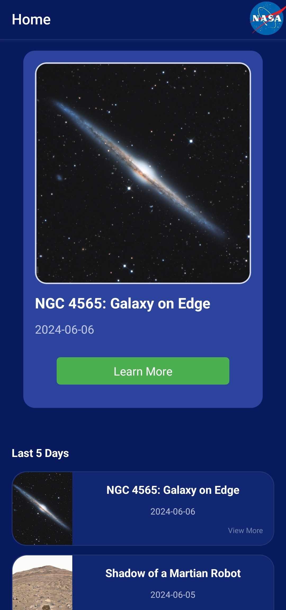
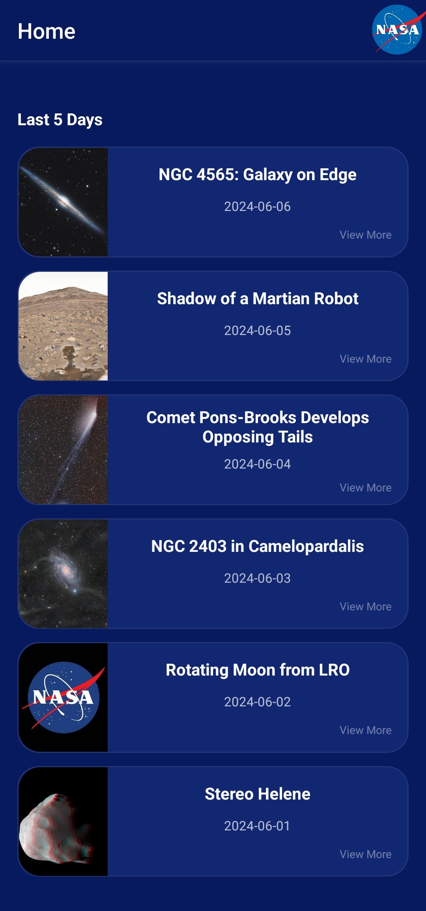
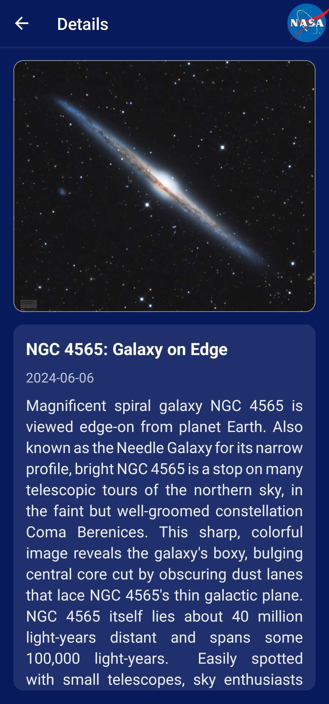

# Nasa App

This App is a simple application that utilizes the NASA API to display the Astronomy Picture of the Day (APOD) and the APOD from the past 5 days. It was created as a practice for using React Navigation and the NASA API.

## Installation

1. Clone the repository

```bash
git clone https://github.com/Gustavoand39/nasa-app.git
```

2. Run `npm install` to install the dependencies
3. Run `npx expo start` to start the app
4. You can run the app on an emulator or on your phone using the Expo Go app

## Preview




